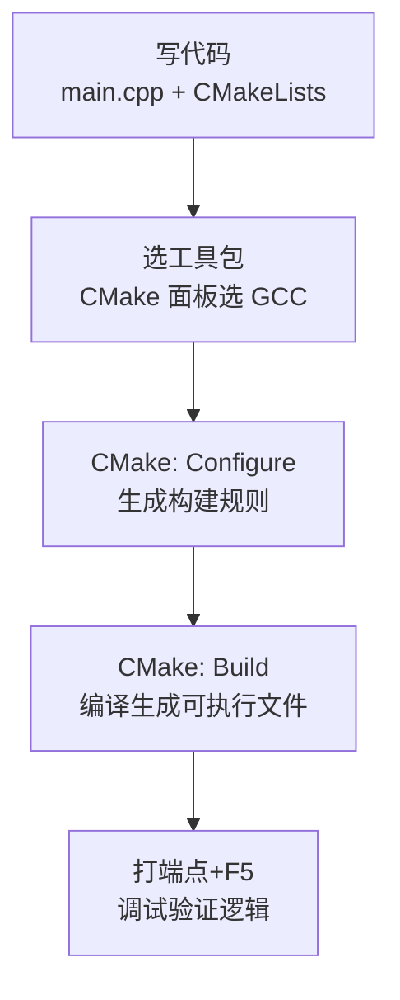

# C++ 项目（WSL + VS Code）配置调试流程总结  
基于手动实操，聚焦**已装插件后**的核心步骤，精简冗余内容  


## 一、项目初始化（手动创建文件+写代码）  
### 1. 核心文件创建（VS Code 资源管理器操作）  
手动新建以下文件（左侧 `资源管理器` → `新建文件`）：  

#### （1）`CMakeLists.txt`（CMake 构建规则）  
```cmake  
# 指定 CMake 最低版本（确保语法兼容）  
cmake_minimum_required(VERSION 3.10)  

# 定义项目名称（影响构建产物命名）  
project(ForStudy)  

# 强制使用 C++17 标准编译（适配现代语法）  
set(CMAKE_CXX_STANDARD 17)  
set(CMAKE_CXX_STANDARD_REQUIRED ON)  

# 生成可执行文件：关联 main.cpp 源码  
add_executable(ForStudy main.cpp)  
```  

- **手动性**：需编写 CMake 语法，错写（如 `add_excutable` 拼写错误）会构建失败。  


#### （2）`main.cpp`（C++ 代码逻辑）  
```cpp  
#include <iostream>  
using namespace std;  

int main() {  
    cout << "Hello, World!" << endl;  

    int num = 10;  
    num += 5;  
    cout << "num 的值为：" << num << endl;  

    return 0;  
}  
```  
- **手动性**：需手写代码，语法错误（如 `cout` 拼错）会编译失败。  


## 二、CMake 配置（手动触发关键步骤）  
### 1. 选择工具包（编译器）  
- **操作**：VS Code 左侧 `CMake` 面板 → 点 `[未选择工具包]` → 选 `GCC x.x.x`（如 `GCC 15.1.1`）。  
- **作用**：指定用 `g++` 编译，选错会导致头文件找不到。  


### 2. 生成构建配置（手动触发）  
按 `F1` → 搜索 `CMake: Configure` → 回车。  
- **作用**：根据 `CMakeLists.txt` 生成构建规则（如 `Makefile` ），输出成功日志：  
  ```  
  -- Configuring done  
  -- Generating done  
  ```  


### 3. 编译项目（手动触发）  
按 `F1` → 搜索 `CMake: Build` → 回车。  
- **作用**：编译生成可执行文件（`build/ForStudy`），输出成功日志：  
  ```  
  [100%] Built target ForStudy  
  ```  


## 三、调试配置（手动打端点+触发调试）  
### 1. 打端点（手动点击行号）  
在 `main.cpp` 代码行号左侧点击，标记红色端点（如 `num += 5;` 行）。  


### 2. 启动调试（手动按 F5）  
按 `F5` → 选 `C/C++: g++ 构建和调试活动文件`（自动生成 `launch.json` ）。  
- **作用**：程序停在端点处，通过调试面板查看变量（如 `num` 值）、单步执行代码。  


## 四、跨环境兼容（关键问题处理）  
### 1. 缓存更新（手动操作）  
改名/换环境后，**手动删 `build` 目录** → 重新 `CMake: Configure` + `CMake: Build`，解决路径残留问题。  


### 2. 常见报错修复  
| 问题现象                  | 手动解决步骤                     |  
|---------------------------|----------------------------------|  
| 头文件找不到（`#include` 报错） | 按 `F1` → 选 `C/C++: Edit Configurations` → 填 `g++` 路径（`/usr/bin/g++` ） |  
| CMake 构建失败（语法错）    | 检查 `CMakeLists.txt` 拼写（如 `add_executable` ） |  


## 核心流程速记  



## 关键学习点  
- **手动强依赖**：从写配置到调试，每一步需主动触发（如 `F1` 搜命令、打端点 ），错一步即报错。  
- **调试核心**：端点+单步执行，验证变量值、代码逻辑，解决实际开发问题。  